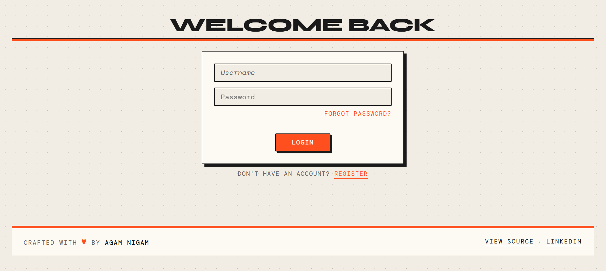
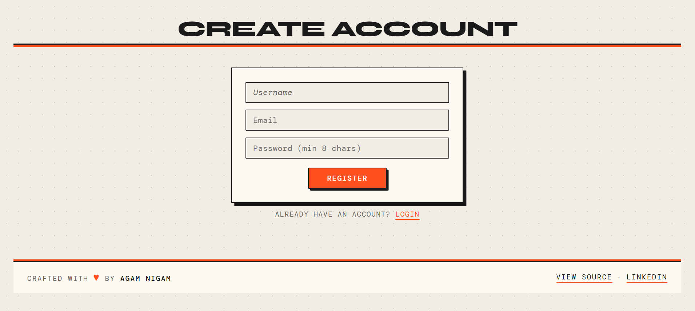
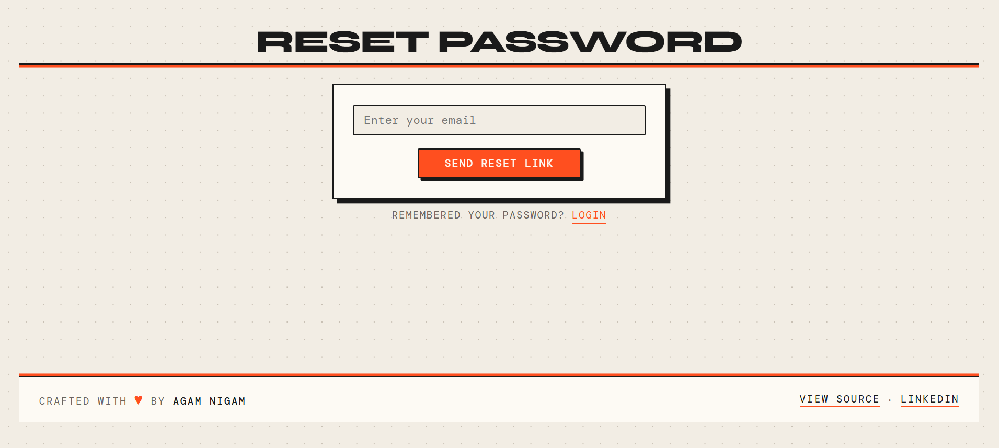
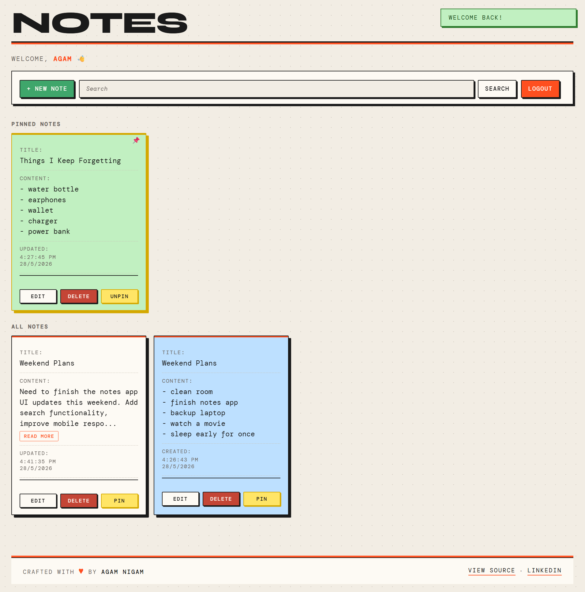
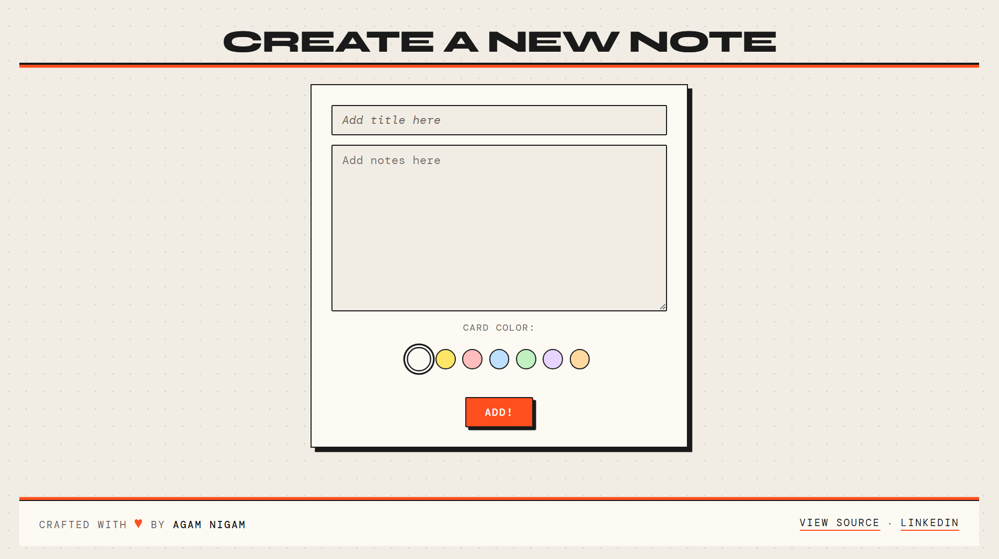
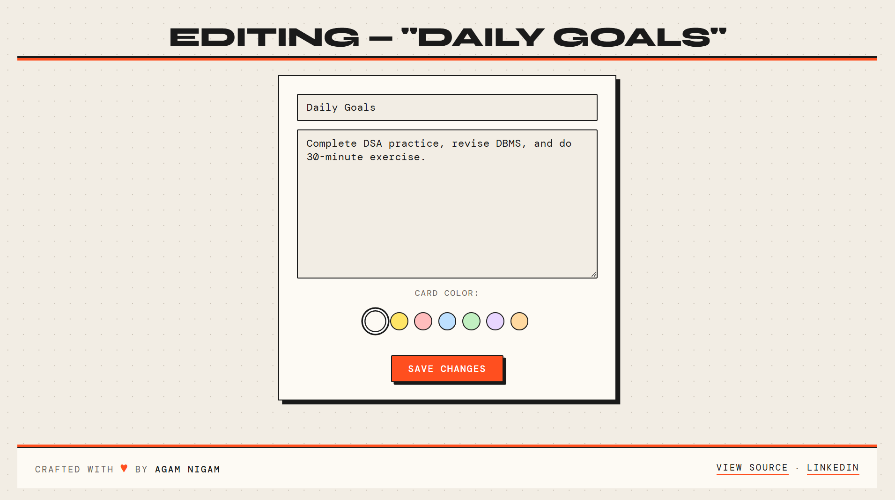
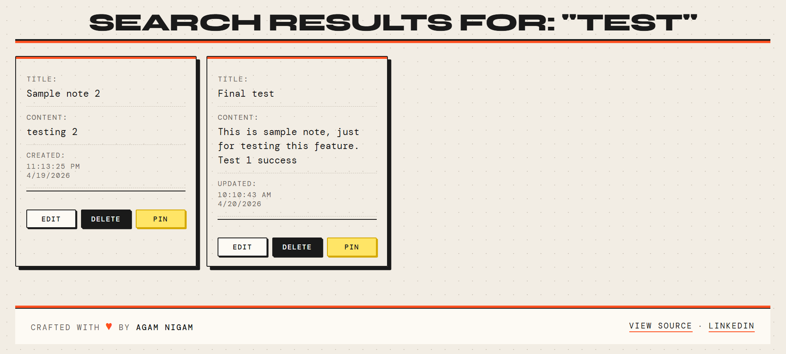
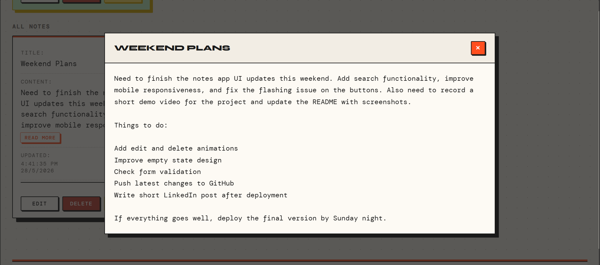

# 📝 Notes Organiser


A full-stack notes management web application built with **Node.js**, **Express**, and **MongoDB**. Features a bold neo-brutalist inspired UI with full user authentication, password recovery, and rich note management.

> 🚀 Live Demo: [Notes Organiser](https://notes-organiser-5b5k.onrender.com/notes)

---

## 🖼️ Preview










---

## ✨ Features

### 📝 Notes
- 📌 **Pin / Unpin Notes** — Keep important notes at the top in a dedicated pinned section
- ✏️ **Create & Edit Notes** — Add a title and content, edit anytime
- 🗑️ **Delete Notes** — Permanently remove notes with confirmation prompt
- 🎨 **Card Colors** — Choose from 7 preset colors for each note card
- 🔍 **Search Notes** — Case-insensitive keyword search across title and content
- 🕐 **Smart Timestamps** — Shows "Created" or "Updated" time in IST
- 🔃 **Auto Sorted** — Notes sorted by most recently updated or created
- 👁️ **Read More Modal** — Long content previewed in card, full content in popup
- 🔒 **Note Ownership** — Users can only see and manage their own notes

### 🔐 Authentication
- Register and login with username and password
- Passwords hashed securely with bcrypt
- Session management with express-session and connect-mongo
- Protected routes with Passport.js local strategy
- Rate limiting on login — max 10 attempts per 15 minutes

### 📧 Password Recovery
- Forgot password page with email-based reset
- Secure token generation with 30-minute expiry
- Token invalidated after single use
- Email delivery via Nodemailer + Gmail SMTP

### 🎨 UI / UX
- Neo-brutalist design — dot-grid background, offset shadows, bold typography
- Flash toast notifications for all actions
- Responsive layout for desktop and mobile
- Auto-dismiss flash messages
- Card title truncation with hover expand
- Empty note prevention

---

## 🛠️ Tech Stack

| Layer          | Technology                              |
|----------------|------------------------------------------|
| Runtime        | Node.js                                  |
| Framework      | Express.js                               |
| Database       | MongoDB + Mongoose                       |
| Templating     | EJS (Embedded JavaScript)                |
| Authentication | Passport.js + bcrypt + express-session   |
| Email          | Nodemailer + Gmail SMTP                  |
| Styling        | Custom CSS (Neo-Brutalist Design)        |
| HTTP Override  | method-override (PUT / PATCH / DELETE)   |
| Security       | express-rate-limit, connect-flash        |
| Deployment     | Render + MongoDB Atlas                   |

---

## 📁 Project Structure

```
notes-organiser/
├── .vscode/
│   └── settings.json
├── assets/
│   ├── Create-note-page.png
│   ├── Edit-note-page.png
│   ├── forget-page.png
│   ├── home.png
│   ├── login-page.png
│   ├── long-note-preview.png
│   ├── register-page.png
│   └── search-output.png
├── middleware/
│   └── isLoggedIn.js          # Route protection middleware
├── models/
│   ├── note.js                # Note schema
│   └── user.js                # User schema
├── public/
│   └── style.css              # Global stylesheet
├── routes/
│   ├── auth.js                # Register, login, logout, password reset
│   └── notes.js               # All note CRUD routes
├── utils/
│   └── mailer.js              # Nodemailer transporter
├── views/
│   ├── partials/
│   │   ├── colorPicker.ejs    # Color swatch picker
│   │   ├── flash.ejs          # Flash toast notifications
│   │   ├── footer.ejs         # Footer with links
│   │   └── noteCard.ejs       # Reusable note card
│   ├── createNote.ejs
│   ├── editContent.ejs
│   ├── emptySearch.ejs
│   ├── forgotPassword.ejs
│   ├── home.ejs
│   ├── login.ejs
│   ├── register.ejs
│   ├── resetPassword.ejs
│   └── search.ejs
├── .env                       # Environment variables (not committed)
├── .gitignore
├── index.js                   # Express app entry point
├── init.js                    # Database seed script
├── LICENSE
├── package.json
└── README.md
```

---

## 🚀 Getting Started

### Prerequisites

- [Node.js](https://nodejs.org/) v14 or higher
- [MongoDB](https://www.mongodb.com/) running locally

### Installation

```bash
# 1. Clone the repository
git clone https://github.com/your-username/notes-organiser.git
cd notes-organiser

# 2. Install dependencies
npm install

# 3. Create .env file in root
touch .env
```

### Environment Variables

Add these to your `.env` file:

```
MONGO_URL=mongodb://127.0.0.1:27017/notes_app
SESSION_SECRET=your_random_secret_here
EMAIL=your_gmail@gmail.com
EMAIL_PASSWORD=your_gmail_app_password
```

```bash
# 4. Start MongoDB locally
mongod

# 5. (Optional) Seed initial data
node init.js

# 6. Start the server
node index.js
```

Open your browser and visit **http://localhost:8080**

---

## 🔗 Routes

### Notes
| Method | Route               | Description                        |
|--------|---------------------|------------------------------------|
| GET    | `/`                 | Redirects to `/notes`              |
| GET    | `/notes`            | Home — pinned + all notes          |
| GET    | `/notes/create`     | Show create note form              |
| POST   | `/notes`            | Save new note                      |
| GET    | `/notes/search`     | Search notes by title or content   |
| GET    | `/notes/:id/edit`   | Show edit form                     |
| PUT    | `/notes/:id`        | Update title, content & color      |
| DELETE | `/notes/:id`        | Delete a note                      |
| PATCH  | `/notes/:id`        | Toggle pin / unpin                 |

### Auth
| Method | Route                  | Description                    |
|--------|------------------------|--------------------------------|
| GET    | `/register`            | Show register form             |
| POST   | `/register`            | Create new account             |
| GET    | `/login`               | Show login form                |
| POST   | `/login`               | Authenticate user              |
| GET    | `/logout`              | Log out current user           |
| GET    | `/forgot-password`     | Show forgot password form      |
| POST   | `/forgot-password`     | Send reset email               |
| GET    | `/reset-password/:token` | Show reset password form     |
| POST   | `/reset-password/:token` | Reset password               |

---

## 🗄️ Database

### Note Schema
```js
{
  title:     { type: String, required: true, maxlength: 100 },
  content:   { type: String, required: true },
  color:     { type: String, default: "#FDFAF4" },
  pinned:    { type: Boolean, default: false },
  owner:     { type: ObjectId, ref: "User" },
  createdAt: Date,   // auto
  updatedAt: Date    // auto
}
```

### User Schema
```js
{
  username:           { type: String, required: true, unique: true },
  password:           { type: String, required: true },
  resetToken:         String,
  resetTokenExpiry:   Date
}
```

---

## 📦 Dependencies

```json
{
  "express":            "^4.x",
  "mongoose":           "^7.x",
  "ejs":                "^3.x",
  "method-override":    "^3.x",
  "passport":           "^0.x",
  "passport-local":     "^1.x",
  "bcrypt":             "^5.x",
  "express-session":    "^1.x",
  "connect-mongo":      "^6.x",
  "connect-flash":      "^0.x",
  "express-rate-limit": "^7.x",
  "nodemailer":         "^6.x",
  "dotenv":             "^16.x"
}
```

```bash
npm install express mongoose ejs method-override passport passport-local bcrypt express-session connect-mongo connect-flash express-rate-limit nodemailer dotenv
```

---

## 🎨 Design

The UI follows a **neo-brutalist** design language:

- Dot-grid paper texture background
- Offset box shadows (`6px 6px 0 #1A1A1A`)
- Bold **Syne** typeface for headings, **DM Mono** for body text
- Pinned notes rendered as yellow sticky notes with 📌 indicator
- 7 preset card colors selectable via visual swatch picker
- Orange-red (`#FF4F1F`) accent color throughout
- Flash toast notifications with auto-dismiss
- Responsive card grid layout

---

## 🔒 Security

- Passwords hashed with bcrypt (12 salt rounds)
- Sessions stored in MongoDB via connect-mongo
- Rate limiting on login route (10 attempts / 15 min)
- Password reset tokens expire after 30 minutes
- Notes filtered by owner — users cannot access others' notes
- Environment variables for all secrets

---

## 👤 Author

**Agam Nigam**
- GitHub: [@agam-nigam](https://github.com/agam-nigam)
- LinkedIn: [Agam Nigam](https://linkedin.com/in/agam-n)

---

## 📄 License

This project is open source and available under the [MIT License](LICENSE).